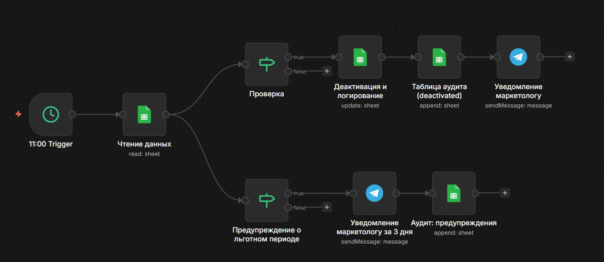
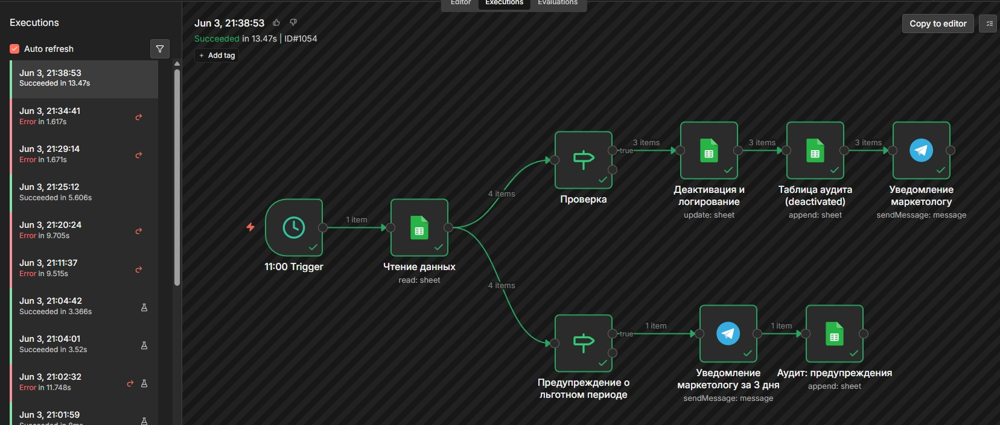
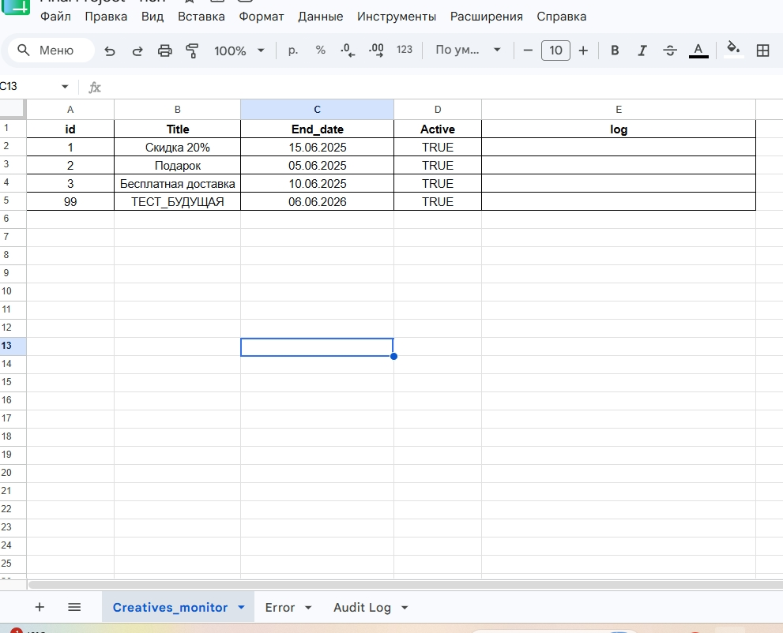
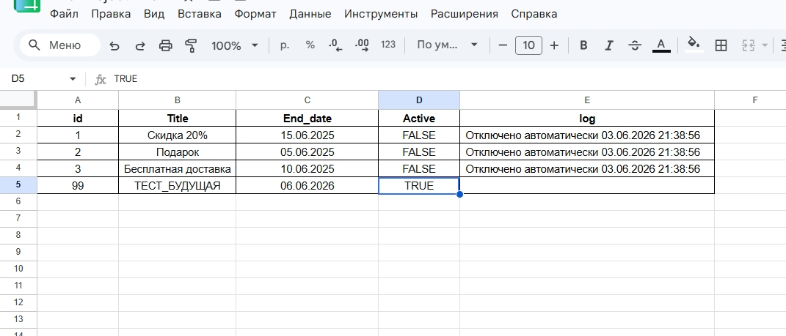
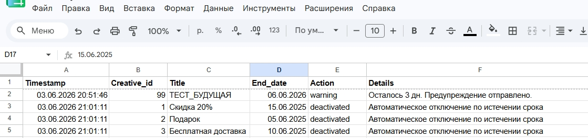
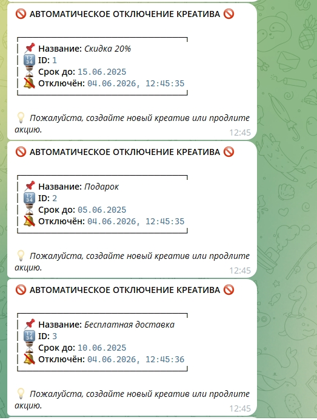
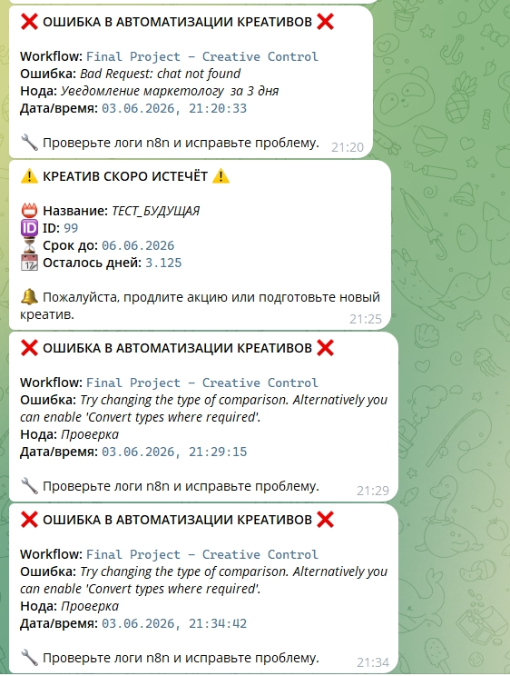

# 🚀 Контроль сроков годности рекламных креативов и промо-материалов

Автоматизация на платформе **n8n** для ежедневного мониторинга, отключения и уведомлений о просроченных баннерах, а также предупреждений за 3 дня до истечения срока.

## 📌 Оглавление
- [Проблема](#проблема)
- [Решение](#решение)
- [Как это работает](#как-это-работает)
- [Технологии](#технологии)
- [Результаты](#результаты)
- [Файлы проекта](#файлы-проекта)
- [Инструкция по запуску](#инструкция-по-запуску)
- [Скриншоты](#скриншоты)
- [Контакты](#контакты)

## ❗ Проблема
Маркетплейсы и лендинги используют десятки рекламных баннеров с ограниченным сроком действия. Из-за человеческого фактора просроченные скидки продолжают показываться, что:
- вводит клиентов в заблуждение
- наносит репутационный ущерб
- требует ручной проверки каждого креатива

## ✅ Решение
Разработана полностью автоматическая система на **n8n**, которая:
- ежедневно проверяет Google-таблицу с креативами
- автоматически отключает просроченные баннеры (меняет статус Active=FALSE)
- отправляет маркетологу уведомления в Telegram:
  - **за 3 дня до окончания** — чтобы успеть продлить акцию
  - **в момент отключения** — чтобы знать, что баннер снят
- сохраняет полный лог всех событий в отдельную таблицу **Audit Log**
- имеет встроенный **обработчик ошибок** — при сбое администратор получает сообщение, ошибка записывается в таблицу

## ⚙️ Как это работает

## 🛠 Технологии
- **n8n** (self-hosted или облачная версия) — оркестрация workflow
- **Google Sheets API** — хранение данных креативов, логов аудита, ошибок
- **Telegram Bot API** — уведомления маркетологу и администратору
- **JavaScript (Luxon)** — обработка дат, сравнение, форматирование

## 📊 Результаты для бизнеса
| Метрика | До автоматизации | После автоматизации |
|---------|------------------|----------------------|
| Показы просроченных акций | ✅ были | ❌ исключены |
| Ручная работа маркетолога (в день) | 30–60 минут | 0 минут |
| Время реакции на истечение срока | от нескольких часов до дней | мгновенно (в 11:00) |
| История отключений | нет | полный аудит |
| Уведомления о сбоях | нет | Telegram + лог |

## 📁 Файлы проекта
| Файл | Описание |
|------|----------|
| `workflows/Final_Project_Creative_Control.json` | Основной workflow (отключение + предупреждения) |
| `workflows/Error_Handler_Creative_Control.json` | Обработчик ошибок |
| `docs/technical_specification.md` | Техническое задание |
| `docs/user_manual.md` | Инструкция по эксплуатации |
| `docs/report.md` | Отчёт по проекту |

## 🧪 Инструкция по запуску (кратко)
1. Установите n8n (self-hosted или используйте облачную версию).
2. Импортируйте два JSON-файла в n8n.
3. Настройте подключения к Google Sheets (OAuth2) и Telegram Bot.
4. Создайте Google-таблицы с указанными листами и колонками (см. ТЗ).
5. Активируйте основной workflow и обработчик ошибок.
6. Настройте расписание в узле Schedule Trigger.
7. Готово! Автоматизация будет запускаться ежедневно.

Подробная инструкция — в `docs/user_manual.md`.

## 📸 Скриншоты

### Canvas workflow (основной)

### Canvas обработчика ошибок

### Пример выполнения (Executions)

### Google Sheets: исходная таблица креативов

### Google Sheets: после отключения

### Google Sheets: таблица аудита

### Telegram: уведомление об отключении

### Telegram: предупреждение за 3 дня / уведомление об ошибке (администратору)

## 🤝 Контакты
По вопросам внедрения, доработки или консультации:

- **Telegram**: [@PyeBuTT]https://t.me/+uvg_FV2EXQE0MWMy)
- **Email**: denisov.sergy@gmail.com

---

⭐ Если проект оказался полезным, поставьте звезду репозиторию!
